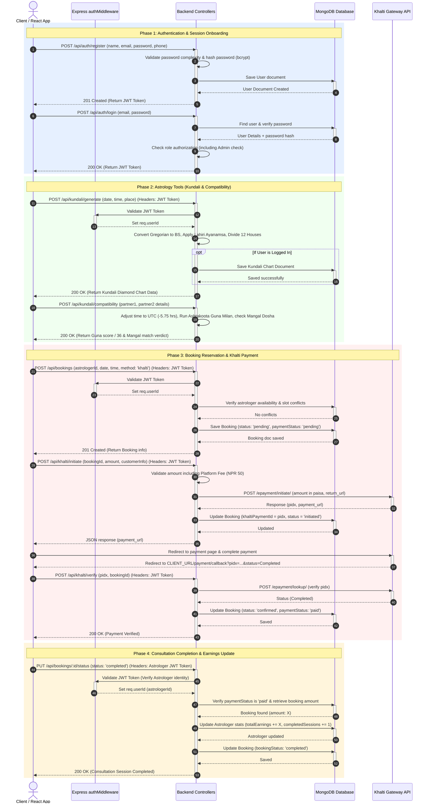

# RashiBazar System Architecture & Visual Diagrams

---

## SYSTEM ARCHITECTURE OVERVIEW

```
┌─────────────────────────────────────────────────────────────────────────┐
│                        RASHIBAZAR PLATFORM                              │
├─────────────────────────────────────────────────────────────────────────┤
│                                                                           │
│  ┌──────────────────┐           ┌──────────────────┐                    │
│  │   FRONTEND       │           │    BACKEND       │                    │
│  │   (React.js)     │           │  (Node.js/Expr)  │                    │
│  ├──────────────────┤           ├──────────────────┤                    │
│  │ Landing Page     │           │ Auth Routes      │                    │
│  │ Login/Signup     │◄──init──► │ Astrologer API   │                    │
│  │ Home             │  HTTP/   │ Booking API      │                    │
│  │ Kundali          │  JSON    │ Kundali Logic    │                    │
│  │ Horoscope        │          │ Horoscope API    │                    │
│  │ Booking          │          │ Admin API        │                    │
│  │ Dashboard        │          │                  │                    │
│  │ (Astro/Admin)    │          │ Business Logic   │                    │
│  └──────────────────┘          └──────────────────┘                    │
│           │                            │                                │
│           └─────────────────┬──────────┘                                │
│                             │                                           │
│                    ┌────────▼────────┐                                 │
│                    │    MONGODB      │                                 │
│                    │   (Database)    │                                 │
│                    │                 │                                 │
│                    │ Collections:    │                                 │
│                    │ • users         │                                 │
│                    │ • astrologers   │                                 │
│                    │ • bookings      │                                 │
│                    │ • availability  │                                 │
│                    │ • kundalis      │                                 │
│                    │ • horoscopes    │                                 │
│                    └─────────────────┘                                 │
│                                                                           │
└─────────────────────────────────────────────────────────────────────────┘
```

---

## COMPLETE USER FLOW DIAGRAM

```
                          LANDING PAGE
                               │
                ┌──────────────┴──────────────┐
                │                             │
         ┌──────▼─────┐              ┌───────▼──────┐
         │ NEW USER   │              │ EXISTING     │
         │ (Signup)   │              │ (Login)      │
         └──────┬─────┘              └───────┬──────┘
                │                            │
        ┌───────┴────────┐          ┌────────┴──────┐
        │                │          │               │
    ┌───▼──┐       ┌────▼──┐    ┌──▼────┐   ┌─────▼──┐
    │User  │       │Astro  │    │Admin  │   │Forgot  │
    │Role  │       │Role   │    │Role   │   │Pass?   │
    └───┬──┘       └────┬──┘    └──┬────┘   └─────┬──┘
        │               │          │              │
        │       ┌───────┴──────────┴──┐           │
        │       │                    │           │
    ┌───▼───────▼────┐    ┌──────────▼──┐  ┌─────▼──────┐
    │   HOME PAGE    │    │  ASTRO      │  │   RESET    │
    │                │    │  DASHBOARD  │  │  PASSWORD  │
    ├────────────────┤    ├─────────────┤  └──────┬─────┘
    │ • Kundali      │    │ • Overview  │         │
    │ • Horoscope    │    │ • Bookings  │    Set Password
    │ • Compatibil.  │    │ • Available │         │
    │ • Calendar     │    │ • Horoscope │         │
    │ • Booking      │    │ • Profile   │    Login
    │ • My Bookings  │    │ • Earnings  │         │
    │ • Profile      │    │             │    ┌────▼──────┐
    └────┬──────┬────┘    └─────┬───────┘    │   HOME    │
         │      │               │            └──────────┘
         │      │        ┌──────▼────┐
         │      │        │ADMIN DASH │
         │      │        ├───────────┤
         │      │        │ • Approve │
         │      │        │ • Stats   │
         │      │        │ • Manage  │
         │      │        └───────────┘
         │      │
    ┌────▼──────▼─┐
    │   BOOKING   │
    │  WORKFLOW   │
    └─────────────┘
         │
    ┌────▼──────────────────────────┐
    │ 1. Browse Astrologers         │
    │ 2. Select Date/Time/Type      │
    │ 3. Add Notes                  │
    │ 4. Create Booking (PENDING)   │
    │ 5. Astro Confirms (CONFIRMED) │
    │ 6. Consultation Happens       │
    │ 7. Mark Completed + Payment   │
    │ 8. Earnings Updated (if PAID) │
    └───────────────────────────────┘
```

---

## DATABASE SCHEMA RELATIONSHIPS

```
                    ┌─────────────────┐
                    │      USER       │
                    ├─────────────────┤
                    │ _id (PK)        │
                    │ name            │
                    │ email (Unique)  │
                    │ password        │
                    │ role            │
                    │ createdAt       │
                    └────────┬────────┘
                             │
                ┌────────────┼────────────┐
                │            │            │
         ┌──────▼──────┐ ┌──▼──────────┐ │
         │   KUNDALI   │ │  BOOKING    │ │
         ├─────────────┤ ├─────────────┤ │
         │ _id (PK)    │ │ _id (PK)    │ │
         │ userId (FK) │ │ userId (FK) │ │
         │ name        │ │ astroId(FK) │ │
         │ birthDate   │ │ date        │ │
         │ birthTime   │ │ time        │ │
         │ birthPlace  │ │ amount      │ │
         │ planets[]   │ │ status      │ │
         │ houses[]    │ │ payStatus   │ │
         │ chartData   │ │ createdAt   │ │
         └─────────────┘ └──────┬──────┘ │
                                 │        │
                    ┌────────────▼─┐     │
                    │ ASTROLOGER   │     │
                    ├──────────────┤     │
                    │ _id (PK)     │     │
                    │ userId (FK)  │     │
                    │ name         │     │
                    │ email        │     │
                    │ experience   │     │
                    │ pricing      │     │
                    │ rating       │     │
                    │ approval     │     │
                    │ earnings     │     │
                    └──────┬───────┘     │
                           │            │
           ┌───────────────┼────────────┘
           │               │
      ┌────▼──────────┐ ┌──▼──────────┐
      │ AVAILABILITY  │ │  HOROSCOPE  │
      ├───────────────┤ ├─────────────┤
      │ _id (PK)      │ │ _id (PK)    │
      │ astroId (FK)  │ │ astroId(FK) │
      │ dayOfWeek     │ │ rashis[]    │
      │ startTime     │ │ period      │
      │ endTime       │ │ prediction  │
      │ duration      │ │ createdAt   │
      └───────────────┘ └─────────────┘
```

---

## BOOKING STATUS LIFECYCLE

```
                         ┌──────────────┐
                         │   PENDING    │◄────── Booking Created
                         └──────┬───────┘
                                │
                ┌───────────────┼───────────────┐
                │               │               │
            ┌───▼──────┐   ┌────▼────┐   ┌─────▼─────┐
            │ CONFIRMED│   │CANCELLED │   │  REJECTED │
            │ (Astro   │   │ (Astro   │   │           │
            │  accepts)│   │  rejects)│   │           │
            └───┬──────┘   └──────────┘   └───────────┘
                │
          ┌─────┴──────┐
          │            │
      ┌───▼────┐   ┌──▼──────┐
      │COMPLETED   │ NO-SHOW  │
      │(Consultation    │ (Didn't
      │ done)      │  show up)
      └───┬────┘   └──────────┘
          │
     ┌────▼──────────────────┐
     │  MARK PAYMENT STATUS  │
     ├───────────────────────┤
     │ YES, PAID             │
     │ NO, PENDING           │
     └────┬──────────────────┘
          │
     ┌────▼────────────────┐
     │ EARNINGS UPDATED?   │
     ├─────────────────────┤
     │ YES → Add to earnings│
     │ NO → Skip earnings   │
     └─────────────────────┘
```

---

## KUNDALI GENERATION FLOWCHART

```
                 INPUT FROM USER
                        │
          ┌─────────────┼─────────────┐
          │             │             │
    ┌─────▼───┐  ┌──────▼──┐  ┌──────▼─────┐
    │Birth    │  │Birth    │  │Birth       │
    │Date     │  │Time     │  │Place       │
    │         │  │         │  │(Lat/Long)  │
    └─────┬───┘  └──────┬──┘  └──────┬─────┘
          │             │             │
          └─────────────┼─────────────┘
                        │
              ┌─────────▼──────────┐
              │GREGORIAN TO LUNAR  │
              │(BS Converter)      │
              └─────────┬──────────┘
                        │
              ┌─────────▼──────────┐
              │CALCULATE SUN       │
              │POSITION           │
              │(Polynomial Formula)│
              └─────────┬──────────┘
                        │
              ┌─────────▼──────────┐
              │APPLY LAHIRI        │
              │AYANAMSA (-23.123°) │
              └─────────┬──────────┘
                        │
              ┌─────────▼──────────┐
              │DETERMINE RASHI     │
              │(Sun Sign)          │
              └─────────┬──────────┘
                        │
              ┌─────────▼──────────┐
              │DIVIDE INTO 12      │
              │HOUSES (30° each)   │
              └─────────┬──────────┘
                        │
              ┌─────────▼──────────┐
              │ASSIGN PLANETS TO   │
              │HOUSES              │
              │(Mercury, Venus,    │
              │ Mars, Jupiter,     │
              │ Saturn, Rahu,      │
              │ Ketu, Moon)        │
              └─────────┬──────────┘
                        │
              ┌─────────▼──────────┐
              │CREATE DIAMOND      │
              │CHART LAYOUT        │
              │H1 at top           │
              │Anti-clockwise      │
              └─────────┬──────────┘
                        │
                    OUTPUT:
              Kundali Chart with 12
              houses and planets
```

---

## API REQUEST-RESPONSE FLOW

```
BOOKING CREATION EXAMPLE:

┌─────────────────────────────────────────────────────────────┐
│ FRONTEND (React)                                            │
├─────────────────────────────────────────────────────────────┤
│                                                              │
│ User fills booking form:                                   │
│ - Select astrologer                                         │
│ - Select date & time                                        │
│ - Select consultation type                                  │
│ - Add notes                                                 │
│                                                              │
│ onClick="handleCreateBooking()"                             │
│ ├─ Validate inputs                                          │
│ ├─ POST /api/bookings                                       │
│ └─ With JWT token in Authorization header                   │
│                                                              │
│ REQUEST BODY:                                               │
│ {                                                            │
│   "astrologerId": "123abc...",                              │
│   "date": "2026-04-07",                                     │
│   "time": "15:15",                                          │
│   "consultationType": "kundali",                            │
│   "notes": "Patient notes here",                            │
│   "paymentMethod": "pay_on_visit"                           │
│ }                                                            │
│                                                              │
│ HEADER: {                                                    │
│   "Authorization": "Bearer eyJhbGc..."                       │
│   "Content-Type": "application/json"                         │
│ }                                                            │
│                                                              │
└──────────────────────┬──────────────────────────────────────┘
                       │ HTTP POST
                       │
        ┌──────────────▼──────────────┐
        │  BACKEND (Express/Node)    │
        ├───────────────────────────┤
        │                            │
        │ POST /api/bookings         │
        │ ├─ authMiddleware         │
        │ │  └─ Verify JWT token    │
        │ │     └─ Extract userId   │
        │ │                         │
        │ └─ bookingController.create
        │    ├─ Validate inputs     │
        │    ├─ Check astro exists  │
        │    ├─ Check slot available│
        │    ├─ Generate bookingId  │
        │    ├─ Create Booking doc  │
        │    └─ Save to MongoDB     │
        │                           │
        │ RESPONSE (HTTP 201):      │
        │ {                          │
        │   "success": true,         │
        │   "booking": {             │
        │     "bookingId": "BOOK...",│
        │     "status": "pending",   │
        │     "amount": 500          │
        │   }                        │
        │ }                          │
        │                            │
        └──────────────┬─────────────┘
                       │
        ┌──────────────▼──────────────┐
        │  MONGODB                   │
        ├───────────────────────────┤
        │                            │
        │ INSERT booking document    │
        │ in "bookings" collection   │
        │                            │
        └───────────────────────────┘
                       │
                       │ HTTP 201 Response
                       ▼
        ┌──────────────────────────────┐
        │ FRONTEND (React)             │
        ├──────────────────────────────┤
        │                              │
        │ Receive response:            │
        │ - Show success toast         │
        │ - Redirect to /my-bookings   │
        │ - Display booking details    │
        │                              │
        └──────────────────────────────┘
```

---

## PAYMENT FLOW

```
                    BOOKING CREATED
                    (Payment Pending)
                           │
     ┌─────────────────────┴─────────────────────┐
     │                                             │
  Waiting Day                            Booking Day
     │                                             │
     │                        Consultation Happens │
     │                                             │
     │                        ┌──────────────────┐ │
     │                        │ Astrologer logs  │ │
     │                        │ into Dashboard   │ │
     │                        └────────┬─────────┘ │
     │                                 │            │
     │                        ┌────────▼────────┐  │
     │                        │ Recent Bookings │  │
     │                        │ Section         │  │
     │                        └────────┬────────┘  │
     │                                 │            │
     │                    ┌────────────▼────────────┐
     │                    │ Payment Status Section  │
     │                    │ "Yes, Paid" button      │
     │                    │ "No, Pending" button    │
     │                    └────────────┬────────────┘
     │                                 │
     │      ┌──────────────────────────┼──────────────────────────┐
     │      │                          │                          │
     │ ┌────▼──────┐            ┌─────▼──────┐           ┌───────▼──┐
     │ │   CLICK   │            │   CLICK    │           │   CLICK  │
     │ │   "YES"   │            │    "NO"    │           │ COMPLETED│
     │ └────┬──────┘            └─────┬──────┘           └───────┬──┘
     │      │                         │                         │
     │ ┌────▼──────────┐      ┌───────▼────────┐      ┌─────────▼──┐
     │ │ Payment       │      │ Payment Status │      │ Booking    │
     │ │ Status =      │      │ stays PENDING  │      │ Status =   │
     │ │ "PAID"        │      │                │      │ COMPLETED  │
     │ └────┬──────────┘      └────────────────┘      └─────────┬──┘
     │      │                                                    │
     │ ┌────▼──────────────────────────────────────────────────────┐
     │ │ Earnings Calculation Triggered                            │
     │ ├──────────────────────────────────────────────────────────┤
     │ │ IF bookingStatus='completed' AND paymentStatus='paid':   │
     │ │   monthlyEarnings += booking.amount                      │
     │ │   totalEarnings += booking.amount                        │
     │ └──────────────────────┬──────────────────────────────────┘
     │                        │
     │                ┌───────▼────────┐
     │                │ Dashboard      │
     │                │ Updated with   │
     │                │ New Earnings   │
     │                └────────────────┘
     │
  Stored in MongoDB
```

---

## AVAILABILITY SLOT MECHANISM

```
         ASTROLOGER CREATES SLOT
                │
     ┌──────────▼──────────┐
     │ Select:             │
     │ • Day: Monday       │
     │ • Start: 10:00      │
     │ • End: 18:00        │
     │ • Duration: 30 min  │
     └──────────┬──────────┘
                │
      ┌─────────▼──────────┐
      │ SYSTEM GENERATES   │
      │ RECURRING SLOTS    │
      └──────────┬─────────┘
                 │
    Every Monday for all weeks:
    10:00, 10:30, 11:00, 11:30, ... 17:30
                 │
      ┌──────────▼──────────┐
      │ Slots stored in     │
      │ AVAILABILITY model  │
      └──────────┬──────────┘
                 │
      ┌──────────▼──────────────────┐
      │ WHEN USER BOOKS A SLOT      │
      ├─────────────────────────────┤
      │ 1. Select Date (e.g. Apr 7) │
      │ 2. Determine day (Monday)   │
      │ 3. Fetch Monday slots       │
      │ 4. Find booked slots        │
      │ 5. Filter available ones    │
      │ 6. Show to user             │
      │ 7. User selects 15:15       │
      │ 8. Create booking           │
      │ 9. Mark 15:15 as booked     │
      └─────────────────────────────┘
```

---

## EARNINGS CALCULATION ALGORITHM

```
INPUT: astrologerId, currentMonth, currentYear

OUTPUT: monthlyEarnings

ALGORITHM:
├─ totalMonthlyEarnings = 0
│
├─ FOR EACH booking in database WHERE:
│  │
│  ├─ booking.astrologerId == astrologerId
│  │
│  ├─ booking.bookingDate.month == currentMonth
│  │
│  ├─ booking.bookingDate.year == currentYear
│  │
│  ├─ booking.bookingStatus == 'completed'
│  │
│  └─ booking.paymentStatus == 'paid'
│     │
│     └─ totalMonthlyEarnings += booking.amount
│
└─ RETURN totalMonthlyEarnings


EXAMPLE:
April 2026 bookings for Astrologer X:

1. April 1: ₹500, status=completed, payment=paid ✅ +500
2. April 5: ₹800, status=completed, payment=pending ❌ skip
3. April 10: ₹600, status=confirmed, payment=paid ❌ skip
4. April 15: ₹500, status=completed, payment=paid ✅ +500
5. April 20: ₹700, status=completed, payment=paid ✅ +700

TOTAL = 500 + 500 + 700 = ₹1700
```

---

## AUTHENTICATION & TOKEN FLOW

```
┌─────────────────────────────────────────────────────────────┐
│ LOGIN PROCESS                                               │
├─────────────────────────────────────────────────────────────┤
│                                                              │
│ 1. User enters email & password                             │
│    └─ Send to POST /api/auth/login                          │
│                                                              │
│ 2. Backend processes:                                        │
│    ├─ Find user by email                                    │
│    ├─ Compare password hash (bcrypt.compare)                │
│    └─ If match:                                             │
│       └─ Generate JWT token:                               │
│          jwt.sign({                                          │
│            userId: user._id,                                │
│            email: user.email,                               │
│            role: user.role                                  │
│          }, SECRET_KEY, { expiresIn: '7d' })                │
│                                                              │
│ 3. Return token to frontend                                 │
│    └─ Store in localStorage                                 │
│       localStorage.setItem('token', jwtToken)               │
│                                                              │
│ 4. Every API request includes token:                        │
│    headers['Authorization'] = 'Bearer ' + token             │
│                                                              │
│ 5. Backend middleware validates:                            │
│    ├─ Extract token from header                             │
│    ├─ Verify signature                                      │
│    ├─ Check expiry                                          │
│    └─ If valid: Continue | If invalid: Return 401           │
│                                                              │
│ 6. Protected routes use ProtectedRoute component:          │
│    ├─ Check token exists                                    │
│    ├─ Decode token                                          │
│    ├─ Check role matches allowed roles                      │
│    └─ Render component or redirect to login                 │
│                                                              │
└─────────────────────────────────────────────────────────────┘

TOKEN STRUCTURE:
header.payload.signature

PAYLOAD:
{
  "userId": "507f1f77bcf86cd799439011",
  "email": "user@example.com",
  "role": "user",
  "iat": 1680000000,         (issued at)
  "exp": 1687200000          (expires at - 7 days later)
}

VERIFICATION ON EACH REQUEST:
Token valid?
├─ YES → Allow request, extract userId
└─ NO → Return 401 Unauthorized
```

---

## ROLE-BASED ACCESS CONTROL

```
        ┌─────────────────────────────────┐
        │   REQUEST TO PROTECTED ROUTE    │
        └──────────────┬──────────────────┘
                       │
              ┌────────▼─────────┐
              │ Check JWT Token? │
              └────────┬─────────┘
                       │
              NO ◄─────┴─────► YES
              │                 │
         ┌────▼──────┐    ┌─────▼──────┐
         │ Redirect  │    │ Extract    │
         │ to Login  │    │ userId     │
         └───────────┘    │ & role     │
                          └─────┬──────┘
                                │
                    ┌───────────▼───────────┐
                    │ Compare role with     │
                    │ allowedRoles[]        │
                    └───────────┬───────────┘
                                │
                    ┌───────────┴───────────┐
                    │                       │
              NO ◄──┴──► YES                │
              │             │               │
         ┌────▼──────┐  ┌───▼────────┐ ┌───▼──────┐
         │ Redirect  │  │ Check API  │ │ Render   │
         │ to Home   │  │ Endpoint   │ │Component │
         └───────────┘  │ Authorization
                        │
                        ├─ astrologer/dashboard
                        │ └─ Allowed: astrologer role only
                        │
                        ├─ admin/dashboard
                        │ └─ Allowed: admin role only
                        │
                        ├─ /booking
                        │ └─ Allowed: user role only
                        │
                        ├─ /kundali
                        │ └─ Allowed: user, astrologer, admin
                        │
                        └─ /horoscope
                           └─ Allowed: user, astrologer, admin

MIDDLEWARE CHAIN:
Request
  ↓
authMiddleware (verify JWT)
  ↓
isAstrologer/isAdmin (check role) - if needed
  ↓
Controller function
  ↓
Response
```

---

## COMPLETE DATA FLOW: KUNDALI GENERATION

```
USER ACTION:
Navigate to /kundali page
  │
  ↓
FRONTEND:
┌─────────────────────────────────────┐
│ Display form:                        │
│ • Birth Date input                  │
│ • Birth Time input                  │
│ • Birth Place input (autocomplete)  │
│ • Gender select                     │
│ • Generate button                   │
└──────────┬──────────────────────────┘
           │
User fills and clicks "Generate"
           │
           ↓
┌──────────────────────────────────────┐
│ Validation:                           │
│ • All fields filled?                  │
│ • Date valid?                         │
│ • Time valid?                         │
│ • Place valid?                        │
└──────────┬───────────────────────────┘
           │
           ↓
POST /api/kundali/generate
WITH DATA:
{
  "name": "John Doe",
  "birthDate": "2000-01-15",
  "birthTime": "14:30",
  "birthPlace": "Mumbai",
  "latitude": 19.0760,
  "longitude": 72.8777,
  "gender": "M"
}
           │
           ↓
BACKEND:
┌──────────────────────────────────────┐
│ kundaliController.generateKundali()  │
│ ├─ Validate inputs                   │
│ ├─ Convert date: Gregorian → BS     │
│ │  (Bikram Samvat lunar calendar)    │
│ │                                    │
│ ├─ Calculate Sun position:           │
│ │  Using polynomial formula           │
│ │  Given: birth time & date           │
│ │  Output: sun degree                 │
│ │                                    │
│ ├─ Apply Lahiri Ayanamsa:            │
│ │  sun_degree - 23.123° = zodiac    │
│ │  E.g., if sun at 45°               │
│ │  45 - 23.123 = 21.877°             │
│ │  This falls in Taurus (Vrishabh)  │
│ │                                    │
│ ├─ Determine Lagna (Ascendant):      │
│ │  Based on birth time hour          │
│ │                                    │
│ ├─ Calculate 12 Houses:              │
│ │  Each house = 30° (360/12)         │
│ │  House 1: 0° to 30°                │
│ │  House 2: 30° to 60°               │
│ │  ... and so on                     │
│ │                                    │
│ ├─ Place planets in houses:          │
│ │  Sun in House 3                    │
│ │  Moon in House 5                   │
│ │  Mars in House 7                   │
│ │  etc.                              │
│ │                                    │
│ ├─ Generate chart data:              │
│ │  Arrange in square diamond format  │
│ │  House positions with planets      │
│ │                                    │
│ └─ Create Kundali document:          │
│    Save to MongoDB                   │
└──────────┬───────────────────────────┘
           │
MONGODB:
Insert document in "kundalis" collection
{
  "_id": ObjectId(...),
  "userId": ObjectId(...),
  "name": "John Doe's Kundali",
  "birthDate": ISODate("2000-01-15"),
  "birthTime": "14:30",
  "birthPlace": "Mumbai",
  "ascendant": "Leo (Sinh)",
  "ascendantRashi": "Leo",
  "moonRashi": "Gemini",
  "planets": [
    {
      "name": "Sun",
      "rashi": "Taurus",
      "degree": "21.88",
      "house": 3,
      "retrograde": false
    },
    ...
  ],
  "chartData": {
    "h1": "Sun",
    "h2": "Neptune",
    ...
  },
  "createdAt": ISODate(now)
}
           │
RESPONSE:
           ↓
Return chart data to FRONTEND
           │
           ↓
FRONTEND RENDERING:
┌────────────────────────────────────┐
│ Display Diamond Chart Layout:      │
│                                    │
│        H12    H1     H2            │
│      ┌──────┬─────┬──────┐        │
│ H11  │      │ SUN │      │ H3     │
│ H10  │      │ LEO │      │ H4     │
│      ├──────┼─────┼──────┤        │
│  H9  │ PLANETS   │ H5    │        │
│  H8  │      │ ... │      │ H6     │
│      ├──────┼─────┼──────┤        │
│  H7  │      │     │      │ H7     │
│      │ H6   │ H5  │ H4   │        │
│      └──────┴─────┴──────┘        │
│                                    │
│ Display details:                   │
│ • Ascendant: Leo                   │
│ • Moon Rashi: Gemini               │
│ • Sun in Taurus (House 3)          │
│ • All planet positions             │
│ • Nakshatras & Padas               │
│ • Dashas (time periods)            │
│                                    │
│ Show full chart data               │
│ Allow download/print option        │
│ Allow save option                  │
└────────────────────────────────────┘
```

---

## QUICK DECISION TREE

```
Am I using this app?
    │
    ├─ YES, as a CLIENT
    │   └─ I want to:
    │       ├─ Book astrologer
    │       │  └─ /booking
    │       ├─ Generate Kundali
    │       │  └─ /kundali
    │       ├─ Check horoscope
    │       │  └─ /horoscope
    │       ├─ Test compatibility
    │       │  └─ /compatibility
    │       └─ Manage my bookings
    │          └─ /my-bookings
    │
    ├─ YES, as an ASTROLOGER
    │   └─ I want to:
    │       ├─ Manage availability
    │       │  └─ /astrologer/dashboard → Availability tab
    │       ├─ Confirm bookings
    │       │  └─ /astrologer/dashboard → Bookings tab
    │       ├─ Mark payment
    │       │  └─ /astrologer/dashboard → Payment section
    │       ├─ Track earnings
    │       │  └─ /astrologer/dashboard → Overview
    │       ├─ Create horoscopes
    │       │  └─ /astrologer/dashboard → Horoscope tab
    │       └─ View analytics
    │          └─ /astrologer/dashboard → Completed bookings
    │
    └─ YES, as an ADMIN
        └─ I want to:
            ├─ Approve astrologers
            │  └─ /admin/dashboard → Pending Approvals
            ├─ View statistics
            │  └─ /admin/dashboard → Analytics
            ├─ Manage users
            │  └─ /admin/dashboard → User Management
            └─ Monitor platform
               └─ /admin/dashboard → All Data
```

---

## SEQUENCE DIAGRAM

The following sequence diagram illustrates the core runtime transactions on the RashiBazar platform in a single figure. It displays the end-to-end user actions categorized into four main phases: Onboarding & Session Setup, Vedic Astrology Tools, Reservation Booking, and Payment Verification with Consultation Completion.



---

*Visual Architecture Guide - Updated May 23, 2026*
