# RashiBazar — Sequence Diagrams (From Codebase)

> [!NOTE]
> All diagrams below are derived **exclusively** from the project source code — controllers, routes, middleware, models, and frontend services.

---

## 1. User Registration

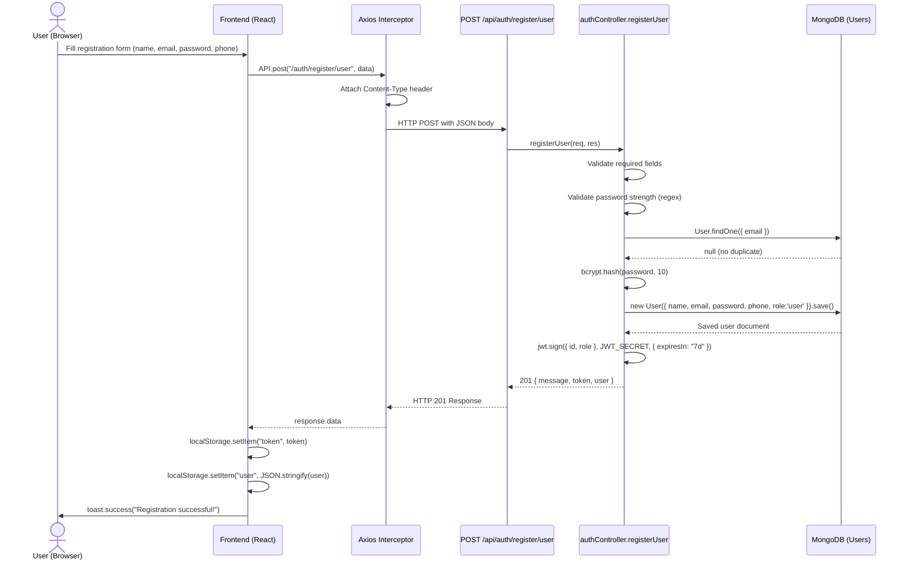

---

## 2. Astrologer Registration

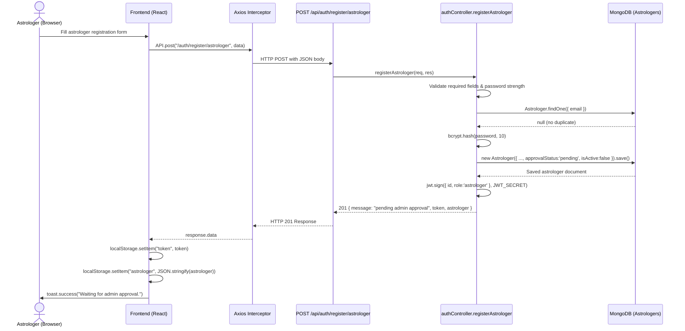

---

## 3. User / Admin Login

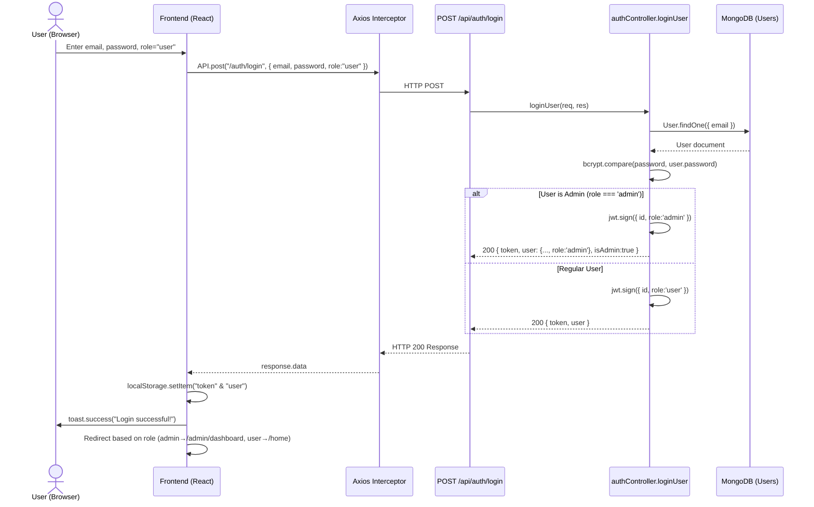

---

## 4. Astrologer Login

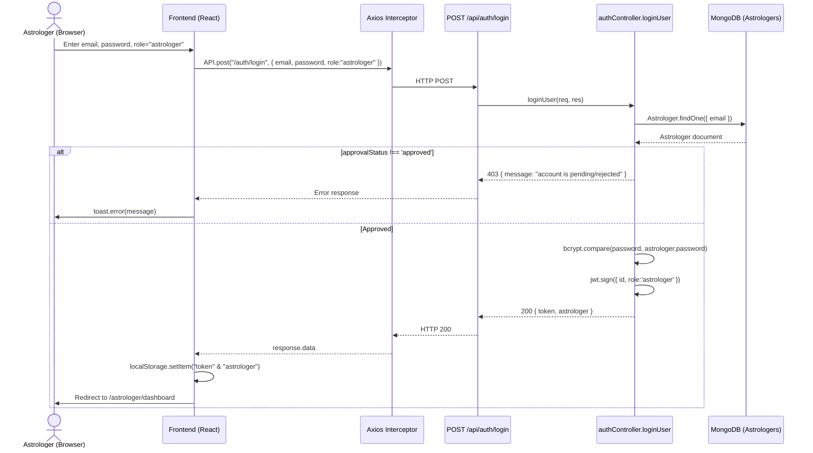

---

## 5. Kundali Generation

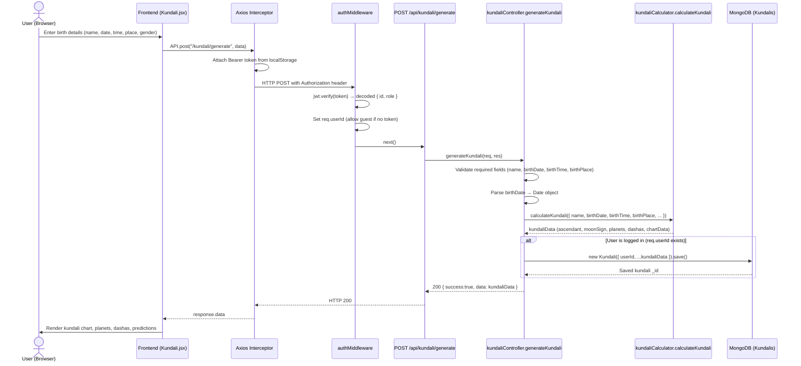

---

## 6. Compatibility Check (Guna Milan)

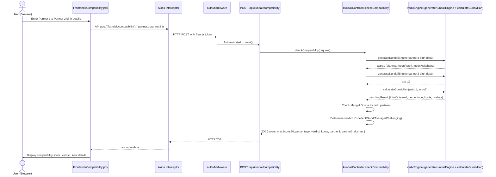

---

## 7. Horoscope Retrieval

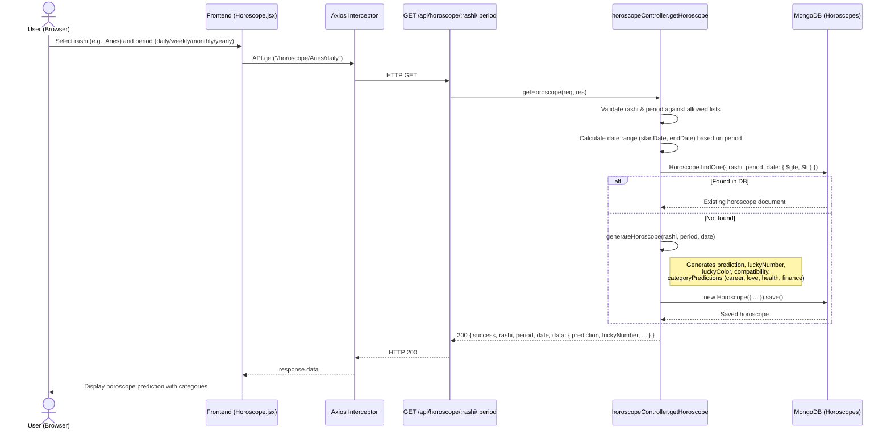

---

## 8. Booking Creation (Pay on Visit)

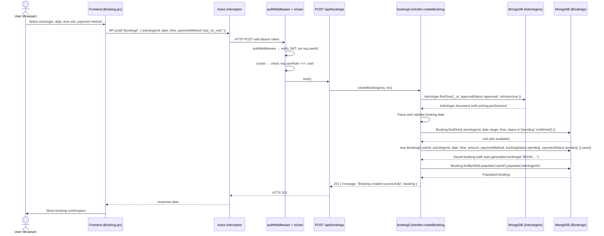

---

## 9. Khalti Payment Flow (Initiate → Pay → Verify)

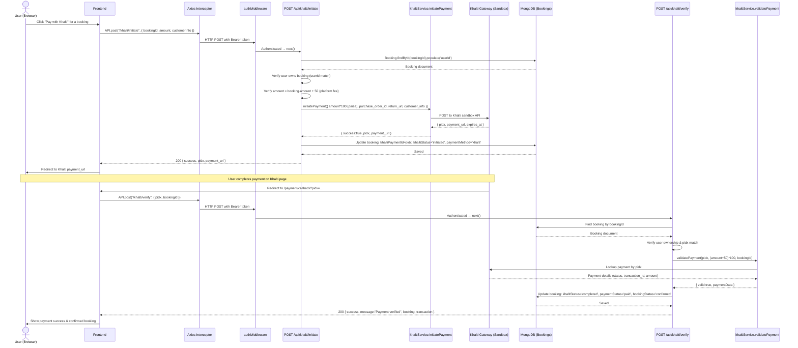

---

## 10. Astrologer Updates Booking Status

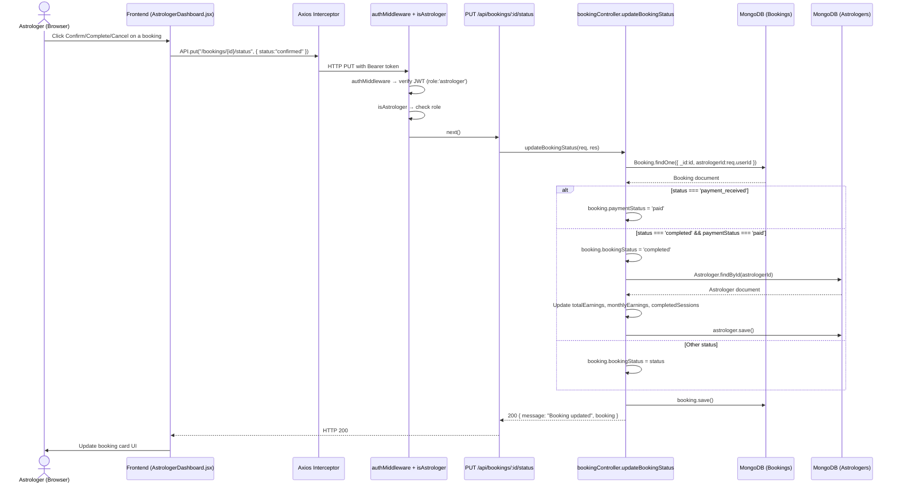

---

## 11. Admin Approves/Rejects Astrologer

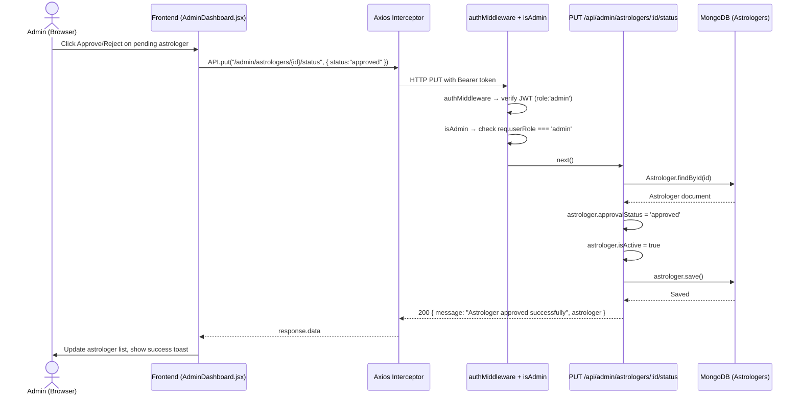

---

## 12. Forgot & Reset Password

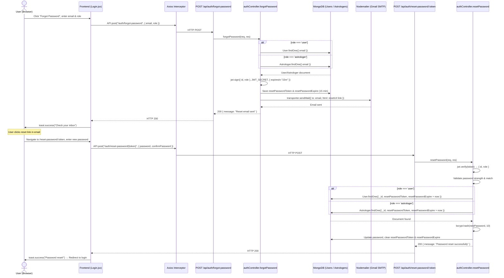

---

## 13. Admin Dashboard Stats

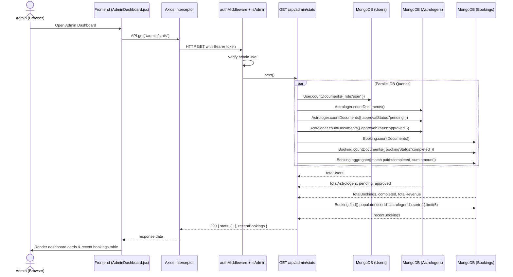

---

## 14. Astrologer Availability Management

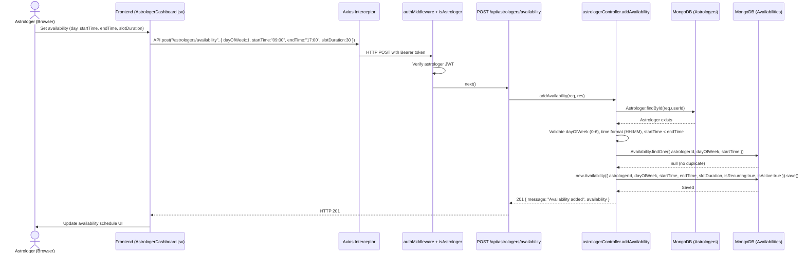

---

## 15. User Cancels Booking

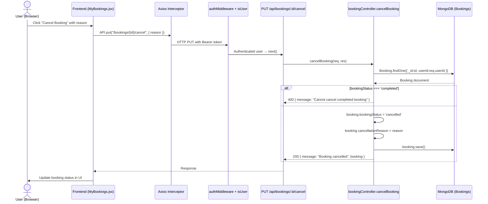

---

## Authentication Middleware Flow (Shared)

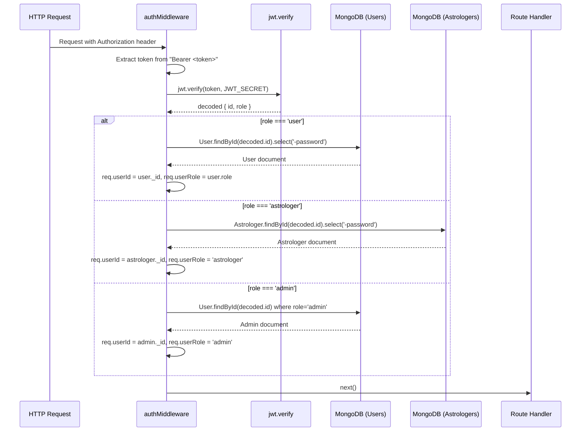
