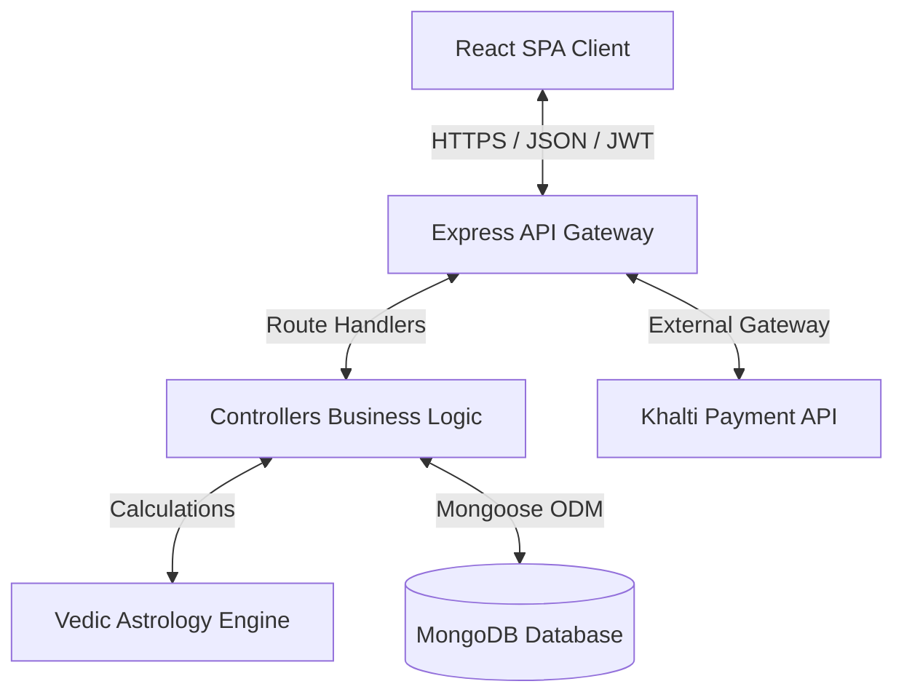
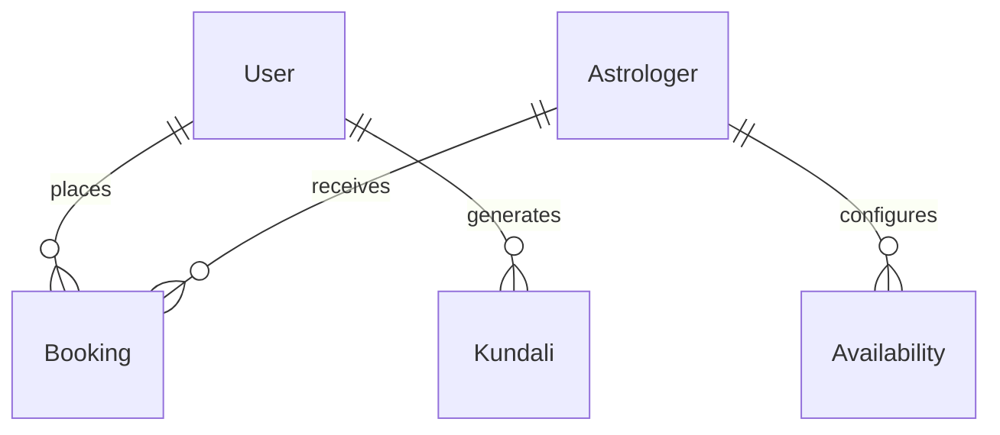

# RashiBazar - Comprehensive Final Year Project Viva Defense & Technical Master Guide

This guide serves as a comprehensive preparation manual for your Final Year Project (FYP) Viva Voce defense for **RashiBazar - Direction Through the Stars**. It breaks down the application into the 20 critical academic and architectural phases required to defend your design decisions, algorithm choices, security implementations, and code structure before an external examination board.

---

## SYSTEM ARCHITECTURE OVERVIEW

RashiBazar is built on the **MERN (MongoDB, Express.js, React.js, Node.js)** technology stack. It uses a decoupled client-server architecture where the frontend (client) and backend (server) communicate statelessy via a RESTful API using JSON.



---

## PHASE 1: PROJECT STRUCTURE ANALYSIS

The project utilizes a standard monorepo folder layout split into `backend/` and `frontend/`.

### Directory Tree Hierarchy
```
RashiBazar/
├── backend/
│   ├── config/             # Database connection, environment load config
│   ├── controllers/        # Express request handlers (business logic)
│   ├── middleware/         # Security, JWT authentication, and role authorization
│   ├── models/             # Mongoose Schemas (Data models)
│   ├── routes/             # REST API endpoint declarations
│   ├── utils/              # Calculation helpers & Vedic astronomical engine
│   └── server.js           # Server startup script & entry point
└── frontend/
    ├── src/
        ├── components/     # Reusable UI widgets & Vedic chart drawers
        ├── lib/            # Shared client constants and BS-AD converters
        ├── pages/          # Page views rendered by React Router
        ├── services/       # Network layer abstraction (Axios wrappers)
        └── App.jsx         # App router & global states
```

### Folder Roles and Rationale

1. **`backend/controllers/`**:
   - *Purpose*: Implements the MVC "Controller" layer. It isolates HTTP request/response handling from data structures and computation logic.
   - *Interactions*: Receives parsed requests from routes, queries Mongoose models, calls `utils/` for calculations, and sends JSON responses back to the client.
   - *Alternative*: Inline handlers in route files. *Disadvantage of alternative*: Leads to a "spaghetti code" anti-pattern, violating the Single Responsibility Principle (SRP) and making unit testing impossible.

2. **`backend/models/`**:
   - *Purpose*: Implements the MVC "Model" layer. Defines schemas, validators, and database constraints.
   - *Interactions*: Imported by controllers to read/write persistent data to MongoDB.
   - *Alternative*: Using raw MongoDB drivers without schemas. *Disadvantage of alternative*: No validation at the application layer; risk of data corruption due to inconsistent document shapes.

3. **`backend/utils/`**:
   - *Purpose*: Houses the core astrological computations and utility algorithms.
   - *Interactions*: Imported by controllers (specifically `kundaliController.js`) to generate charts and matching scores.
   - *Alternative*: Coupling calculations inside controllers. *Disadvantage of alternative*: Astrological logic is not reusable; codebase bloats.

4. **`frontend/src/components/` vs `frontend/src/pages/`**:
   - *Purpose*: Separation between stateless UI components (pure widgets) and stateful container components (pages).
   - *Interactions*: Pages fetch data via services, pass down props to components, and render them.
   - *Architecture Rationale*: Reusability. `KundaliChart.jsx` is used both in the user-facing Kundali screen and inside the astrologer's consulting dashboard.

---

## PHASE 2 & 3: FILE-BY-FILE & IMPORT ANALYSIS

Below is the architectural analysis of the system's most critical files.

### 1. `backend/server.js`
- **Purpose**: Application bootstrapper. Configures Express middleware, connects to MongoDB, and binds HTTP routes to the network port.
- **Execution**: Starts on application launch (`npm run dev`).
- **Key Imports**:
  - `express`: Core framework for handling HTTP routing and middleware.
  - `cors`: Cross-Origin Resource Sharing middleware. Secures the backend by defining which client origins can access API endpoints.
  - `connectDB`: Custom database connection function.
- **Architectural Importance**: Implements graceful fallback logic. If the preferred port (e.g., 5000) is occupied, the port listener catches `EADDRINUSE` and automatically assigns port `0` (letting the OS assign a random free port), preventing application crashes during deployment.

### 2. `backend/middleware/authMiddleware.js`
- **Purpose**: Authenticates requests using JSON Web Tokens (JWT).
- **Execution**: Intercepts HTTP requests on protected API endpoints.
- **Flow**:
  1. Inspects the `Authorization` header for a `Bearer <token>` pattern.
  2. If absent, allows bypass only if the route is `/api/kundali/generate` (to support guest user calculations). Otherwise, returns `401 Unauthorized`.
  3. Verifies the signature using `jwt.verify(token, JWT_SECRET)`.
  4. Queries the corresponding collection based on the decoded token's role (`user` or `astrologer`).
  5. Populates `req.userId`, `req.userRole`, and the Mongoose user document to `req.user` or `req.astrologer` before calling `next()`.
- **Imports**:
  - `jsonwebtoken`: Validates signed tokens.
  - `User`, `Astrologer`: Mongoose models to verify user existence.

### 3. `backend/controllers/bookingController.js`
- **Purpose**: Implements slot booking logic, double-booking prevention, and state transitions for consultations.
- **Key Function: `createBooking`**:
  - *Parameters*: `req.body` containing `astrologerId`, `date`, `time`, `paymentMethod`, `notes`.
  - *Concurrency Protection*: Checks if a booking already exists for that date and time for the given astrologer with status `pending` or `confirmed`.
  - *Khalti Expiry Check*: Evaluates if a slot has a pending Khalti payment. If the payment was initiated more than 15 minutes ago (`fifteenMinsAgo = new Date(Date.now() - 15 * 60 * 1000)`), the reservation is ignored, freeing the slot for other users.
- **Viva Point**: Relies on a compound database query to verify slot availability, ensuring that abandoned checkout sessions do not block astrologers' schedules indefinitely.

---

## PHASE 4 & 11: THE KUNDALI CALCULATOR & VEDIC ENGINE

To defend your system before astrological and mathematical experts, you must explain how astronomical coordinates are converted into traditional Vedic charts.

### The Calculation Pipeline
```
[User Wall Time & Place] 
    --> Convert to UTC (Subtract 5:45 timezone offset) 
    --> Convert to Julian Day (Continuous day count)
    --> Calculate Tropical Coordinates (Using astronomy-engine)
    --> Apply Lahiri Ayanamsa Correction (Convert Tropical to Sidereal)
    --> Determine Ascendant (Lagna) & Planetary Houses
    --> Decompose longitudes into Rashis, Nakshatras, and Padas
    --> Generate Divisional Charts (D1, D9, D3, D12)
```

### Mathematical & Astrological Formulas

#### 1. Julian Day Calculation
A Julian Day represents the continuous count of days since January 1, 4713 BC. This representation simplifies celestial orbital tracking.
$$JD = \lfloor 365.25 \times (Y + 4716) \rfloor + \lfloor 30.6001 \times (M + 1) \rfloor + D + \frac{H}{24} + B - 1524.5$$
Where $B$ is the Gregorian calendar leap correction factor.

#### 2. Lahiri Ayanamsa (Sidereal Conversion)
Vedic astrology uses the Sidereal (Nirayana) zodiac system, which aligns with fixed stars, unlike the Western Tropical (Sayana) system which aligns with the equinoxes. The difference is the **Ayanamsa** (precession of equinoxes, roughly 50.29 seconds of arc per year).
Your engine approximates the Lahiri Ayanamsa via:
$$\text{Ayanamsa} = 23.85709^\circ + \left(0.0139688^\circ \times \frac{JD - 2451545.0}{365.25}\right)$$
This value is subtracted from the planet's tropical longitude to get its Nirayana longitude:
$$\lambda_{\text{sidereal}} = (\lambda_{\text{tropical}} - \text{Ayanamsa}) \pmod{360^\circ}$$

#### 3. Lagna (Ascendant) Computation
The Ascendant is the rising degree of the zodiac on the eastern horizon at the local birth time. The engine:
1. Calculates Greenwhich Sidereal Time (GST).
2. Calculates Local Sidereal Time (LST): $\text{LST} = \text{GST} + \text{Longitude}$.
3. Converts LST to Right Ascension of Meridian (RAMC).
4. Solves for the intersection of the horizon with the ecliptic using spherical trigonometry:
$$\text{Lagna} = \arctan2(\cos(\text{RAMC}), -(\sin(\text{RAMC})\cos(\epsilon) + \tan(\phi)\sin(\epsilon)))$$
Where $\epsilon$ is the obliquity of the ecliptic and $\phi$ is the birth latitude.

#### 4. Vimshottari Dasha Calculation
A cyclic 120-year planetary period system calculated from the Moon's longitude.
1. The Moon's Nirayana longitude ($\lambda_{\text{Moon}}$) is mapped to one of the 27 Nakshatras (each spanning $13^\circ 20'$ or $13.333^\circ$).
$$\text{Nakshatra Index} = \lfloor \frac{\lambda_{\text{Moon}}}{13.333^\circ} \rfloor$$
2. The remaining fractional distance within that Nakshatra determines the starting planet's dasha balance:
$$\text{Fraction Remaining} = 1 - \frac{\lambda_{\text{Moon}} \pmod{13.333^\circ}}{13.333^\circ}$$
$$\text{Balance Years} = \text{Dasha Lord's Total Years} \times \text{Fraction Remaining}$$

---

## PHASE 8: DATABASE SCHEMA & MODEL ANALYSIS

MongoDB is used for document persistence. Mongoose enforces type validation, default values, references, and indexes.



### Schema Rules & Optimization

1. **`User` Model**:
   - `email`: Enforces lowercased unique string indexing to optimize authentication lookups and prevent duplicate registrations.
   - `role`: Restricted via Mongoose `enum` to `['user', 'astrologer', 'admin']` to prevent unauthorized privilege escalation.

2. **`Astrologer` Model**:
   - `approvalStatus`: Enum `['pending', 'approved', 'rejected']`. Astrologers cannot log in or take bookings until this flag is flipped to `approved` by an admin.
   - `canUpdateHoroscope`: A boolean flag restricting access to global horoscope upload APIs to specific approved experts.

3. **`Availability` Model**:
   - Uses compound indexes to prevent double-entries and schedule collisions:
     ```javascript
     availabilitySchema.index({ astrologerId: 1, dayOfWeek: 1, startTime: 1 }, { unique: true });
     ```
   - Uses a pre-save hook to ensure availability slots do not overlap with existing slots for the same astrologer:
     ```javascript
     if (startMinutes < existingEnd && endMinutes > existingStart) throw new Error('Overlap');
     ```

---

## PHASE 10: AUTHENTICATION & SECURITY

### 1. JSON Web Token (JWT) Implementation
- **Mechanism**: The server generates a JWT containing the payload `{ id: user._id, role: user.role }`, signed with a strong cryptographic secret key (`JWT_SECRET`) using the `HS256` algorithm.
- **Client Handling**: The client stores this token in `localStorage` and appends it to the `Authorization` header of outgoing API requests:
  ```
  Authorization: Bearer <JWT_token_string>
  ```
- **Security Check**: This is a stateless session strategy. Because the server does not store session IDs in memory, it scales easily. Cryptographic integrity is verified on every request using `jwt.verify()`.

### 2. Threat Vector Mitigations

| Threat | How it works | Project Defense / Mitigation |
| :--- | :--- | :--- |
| **SQL / NoSQL Injection** | Attacker inserts query operators (like `{"$gt": ""}`) to bypass auth. | **Mongoose ODM**: Automatically casts input variables to schema types. Strings are treated as literal strings, not query operators. |
| **Cross-Site Scripting (XSS)** | Attacker injects malicious JS into inputs that render on other users' pages. | **React Encoding**: React's JSX automatically escapes variables before rendering them to the DOM, rendering them as strings rather than executable code. |
| **Cross-Site Request Forgery (CSRF)** | Exploiting browser cookies to make unauthorized calls on behalf of logged-in users. | **Token-based Architecture**: The system does not use ambient browser credentials (cookies). Because the JWT must be read from local storage and appended manually to header fields via Axios request interceptors, cross-origin scripts cannot forge requests. |
| **Brute Force Attacks** | Attacker repeatedly guesses passwords. | **Bcrypt Hashing**: Passwords are hashed with `bcryptjs` using a salt work factor of 10. The slow, CPU-intensive hashing computation makes brute-force attempts computationally expensive. |

---

## PHASE 14: DEPENDENCY ANALYSIS (`package.json`)

Key dependencies are listed below with their architectural role and viva significance.

1. **`astronomy-engine`**:
   - *Role*: Calculates high-precision planetary coordinates and astronomical events.
   - *Why chosen*: Avoids loading massive Swiss Ephemeris C-libraries onto server environments, enabling serverless hosting on Render/Vercel.
   - *Alternative*: `sweph` (requires local C binary compilation).

2. **`bcryptjs`**:
   - *Role*: Implements password hashing and salt generation.
   - *Why chosen*: Pure JS implementation of bcrypt, avoiding node-gyp compilation failures across differing host systems (Windows vs Linux).

3. **`nepali-date-converter`**:
   - *Role*: Converts standard Gregorian Calendar dates (AD) to Bikram Sambat (BS) for Nepali astrological calendar representation.

4. **`date-fns`**:
   - *Role*: Implements date arithmetic for calendar layouts and slot reservation windows.
   - *Why chosen*: Immutable date helper functions, avoiding the mutating state issues found in legacy libraries like `moment.js`.

---

## PHASE 16: SYSTEM TESTING & ASSURANCE

You must demonstrate how the system was validated before deployment.

### 1. Verification vs Validation
- **Verification**: "Are we building the system right?" (Does the code match the design patterns? Verified via static linting and compiler checks).
- **Validation**: "Are we building the right system?" (Does the Kundali calculations align with standard planetary ephemerides? Validated by comparing system outputs with reference charts from the Nepal Panchanga).

### 2. Testing Levels Applied
- **Unit Testing**: Testing the pure logic of the Ayanamsa and degree decomposition functions in `vedicEngine.js` with mock time values.
- **Integration Testing**: Testing the Khalti callback controller to ensure the database updates the booking status only when the signature is successfully verified by the gateway API.
- **User Acceptance Testing (UAT)**: Validating mobile responsiveness, checking that all tables compress gracefully on small screens, and verifying that astrologer dashboard filters display today's vs previous appointments clearly.

---

## PHASE 18: EXTREME VIVA DEFENSE QUESTION BANK

Here are the most common and difficult questions an examiner will ask you during your project defense, along with model answers.

### Q1: Why did you choose MongoDB over SQL (like PostgreSQL) for this application?
- **Short Answer**: To store dynamic, nested structures (astrological charts, availability parameters, divisional tables) in flexible BSON structures without the performance overhead of complex table joins.
- **Detailed Answer**: Astrological profiles contain nested arrays (e.g., planet positions, 120-year Dasha hierarchies, and 12-sign Ashtakavarga charts). In a relational database, storing this would require multiple normalized tables connected by foreign keys, requiring heavy JOIN operations. MongoDB allows us to persist this as a single document, matching the JSON-centric data model of React and Node.js. It increases write/read speeds for astrological charts.

### Q2: How does your booking system prevent two clients from booking the same astrologer at the same time?
- **Short Answer**: We run a validation query at the database level before creating the booking, ignoring expired pending payments.
- **Detailed Answer**: When a user submits a booking, `bookingController.js` performs a `findOne` query looking for bookings with the same `astrologerId`, date, and time slot. It filters for bookings that are `pending` or `confirmed`. To prevent abandoned checkouts from permanently locking slots, the query ignores bookings with payment method `khalti` and payment status `pending` if the creation timestamp is older than 15 minutes. This creates a reservation window that auto-expires if the payment is not completed.

### Q3: Explain what Lahiri Ayanamsa is and why it's needed in your code.
- **Short Answer**: It corrects the tropical positions of stars (from Western astronomy packages) to sidereal positions used in Vedic astrology to account for the Earth's axis wobble.
- **Detailed Answer**: Standard astronomical packages (like `astronomy-engine`) compute planetary longitudes relative to the equinox (Tropical system). Due to the precession of the equinoxes, the Earth's axis wobbles at roughly $50.29''$ per year. Vedic astrology uses the Sidereal system, which is anchored to fixed constellations. The Lahiri Ayanamsa represents the longitudinal difference between these two systems (currently around $24^\circ$). Our code calculates the Ayanamsa for the birth time and subtracts it from the tropical longitude to yield the sidereal longitude.

### Q4: If a hacker intercepts your JWT token, how do you prevent them from accessing Admin features?
- **Short Answer**: The token payload contains a cryptographically signed role. The server checks this role at the route middleware layer.
- **Detailed Answer**: When a token is generated, the payload contains the user's role (e.g., `role: 'user'`). This payload is signed using our server's private key (`JWT_SECRET`). If a user attempts to call an admin API, the request goes through the `isAdmin` middleware, which verifies the signature and checks if `req.userRole === 'admin'`. Even if a hacker modifies the token payload client-side to read `role: 'admin'`, the signature verification check will fail because the hacker does not have the private key to resign the token.

### Q5: What is the purpose of React Context / State management in your application?
- **Short Answer**: It provides a global store for user authentication states across all routes, preventing prop-drilling.
- **Detailed Answer**: We use global state to track the active session user, role, and authorization status. By wrapping the root Component tree in our auth state provider, any component (like `Navbar.jsx` or `ProtectedRoute.jsx`) can verify if a user is logged in without needing to pass user props down through multiple layers of components.

### Q6: How does the system handle Khalti payment verification securely?
- **Short Answer**: The client receives a callback, but the server validates the payment status directly by making a secure backend-to-backend API call to Khalti.
- **Detailed Answer**: When a client returns from the Khalti interface with a payment ID, we do not trust the client-side state. The client redirects to `PaymentCallback.jsx`, which extracts the transaction parameter (`pidx`) and calls our backend endpoint. The backend server then makes a direct secure HTTP request to the Khalti validation endpoint using the private server key (`KHALTI_SECRET_KEY`) to confirm the status is `Completed` and matches the booking's exact financial amount. Only then do we change the status in MongoDB to `confirmed` and `paid`.

---

## PHASE 19: SIMULATING THE VIVA

Review this guide to prepare for your defense. Focus on understanding the **data flow** and **algorithms** behind the astrological computations, as examiners frequently target math calculations and security models. Let this file be your study reference. Good luck!
